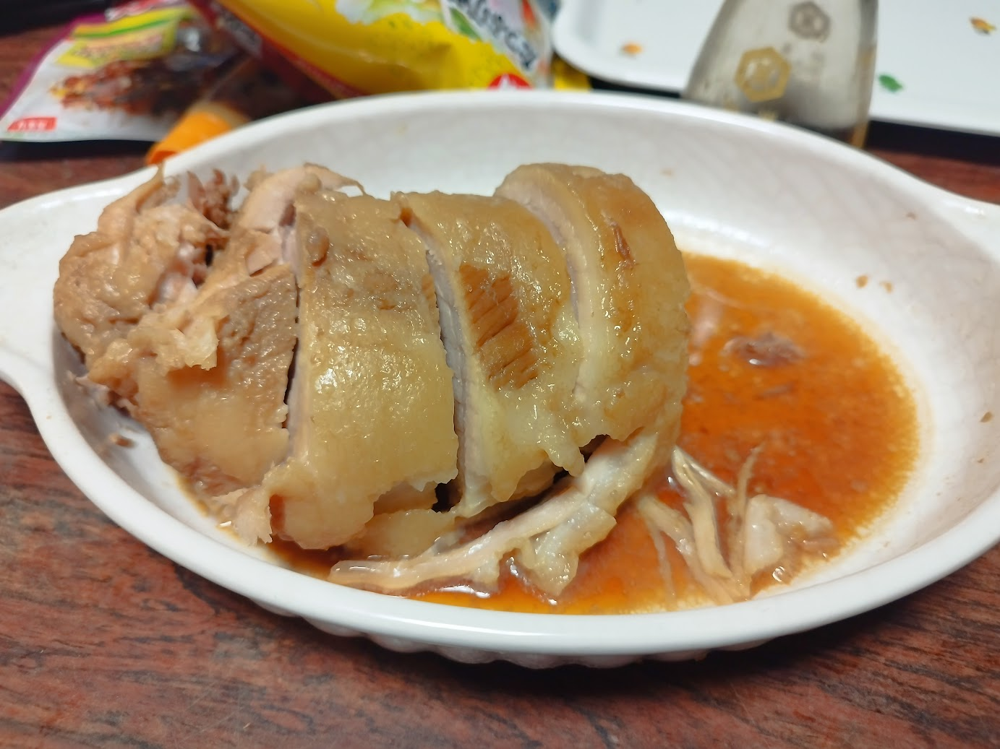

最近ラーメン二郎にはまっています、山田ハヤオです。大学1年の夏、友人に勧められて以降すっかり中毒になってしまいました。

GITY周辺にもトップクラスに美味しい二郎系のお店があるので紹介します。初めて行く人向けに、入店方法やコールについても説明します。

## GITY二郎同好会?

後述する通り、GITYから徒歩圏内に**ラーメン二郎前橋千代田店**があるため、GITYの学生は夕食に二郎を選択することが非常に多いです。[^1]

二郎によく行くメンバーを**私が勝手に**<u>二郎同好会</u>と呼称しています。[^2]

二郎同好会では常に新規会員を募集しています。参加方法は簡単で、GITYにいる誰かに「一緒に二郎いかない?」と誘うだけです。これであなたも同好会会員!

ハヤオは誰かに誘われたら金欠でない限りなるべく参加するので、気軽に声をかけてください。

## 二郎系とは?

二郎系とは、**ラーメン二郎 三田本店**から暖簾分けした店舗や、その味をオマージュしたラーメン屋のことを指します。

**ラーメン二郎**から暖簾分けし本店と同様の醤油を利用している店舗を**直系**と呼びます。一方で、ラーメン二郎の味をインスパイアし非公式に似た味を提供しているラーメン屋を**インスパイア系**と呼びます。

スープも麺も店舗によって様々ですが、概ね以下のような共通項があります。

- スープは豚骨醤油ベース
- ラーメンの具材はモヤシ, キャベツ, 背脂, 豚(分厚いチャーシュー)
- コールと呼ばれるトッピングの量を調整する呪文を唱える
- 最も麺量の少ないメニューでも通常のラーメンの倍以上の量

以上の特徴より、初めての人は怖いといった印象を持ち入店を渋ってしまうことも多いでしょう。

また、いくつかのルールがありこれらを破ると注意を受けることもあります。

これらについても簡単に説明しますが、より詳細な情報は他のウェブサイトで詳しく説明されていますのでそちらも御覧ください。

## コール

二郎系の店舗では「コール」と呼ばれる呪文によってラーメンを任意の構造にカスタマイズできます。コンパイルオプションのようなものですね。

対応しているコールは店舗によって対応しているものとその返り値が異なるため、事前に調べておくことが重要です。[^3]

コールは基本的に具材と量の組み合わせで構成されます。まずプリミティブな世界に具材を導入しましょう。

$$
T = \{ \mathtt{ニンニク},\ \mathtt{ヤサイ},\ \mathtt{アブラ},\ \mathtt{カラメ} \}
$$

カラメとは豚骨のダシに追加するカエシのことです。これを増やすことをカラメと呼びます。

次の量を定義します。

$$
M = \{ \Phi,\ \mathtt{ナシ}, \mathtt{少なめ},\ \mathtt{マシ},\ \mathtt{マシマシ} \}
$$

量は省略することができ、その場合はマシと同じ意味になります。これで、プリミティブな単語を定義できました。

そして、各具材と量の組み合わせは以下のように行います。

$$
W = \{ t \cdot m\ |\ t \in T,\ m \in M \}
$$

この具材表現には例外もあり、すべての具材を同時に指定することもできます。つまり、以下のことです。

$$
G = \{ \mathtt{全部},\ \mathtt{全} \} \cdot M
$$

これらにより、最終的に以下の言語が完成します。

$$
L = W^+ \cup G
$$

## ルール

二郎系ラーメンのお店はランタイム環境ですから、当然エラーもあります。我々ユーザーは各店舗のプロトコルに従う必要があります。

また、この実行環境は複数ユーザーによってリソースを共有していますから、お行儀よく実行しないとカーネルによってKillされるかもしれません。

主に以下が言われていますが、環境固有のものもあります。

- 先にコールを言わない  
  エラーコード「ロット乱し」と呼ばれるもので、各店舗がコールの受信を待機するまでコールを行ってはいけません。多くの店舗では店員さんに聞かれたら答えれば良いです。
- 食べきれない量を注文しない  
  リソースの無駄遣いはお店側に失礼です。食べ切れる量をコールしましょう。
- 長居しない  
  1つのプロセスが特定のリソースを占有するのは好ましいことではありません。
- 食後は席を拭き、素早く退店する  
  クリーンアップ処理を忘れずに行いましょう。

他にも、駐車場や並び方について提示がされていることがあります。それに従いましょう。

## GITY周辺のおすすめ店

### 1. ラーメン二郎 前橋千代田店

直系のラーメン二郎です。GITYから徒歩5分くらいで行けます。

- 小ラーメン
- 小ブタラーメン
- 大ラーメン
- 大ブタラーメン

しかないシンプルなメニューの店舗ですが、味は本物です。

僅かに乳化したスープにバチッと決まった醤油の組み合わせに平打ちの麺が良く絡みます。ブタは薄くて硬めですが、しっかりと味が染みており胡椒との相性は抜群。

小ラーメンが麺量茹で前250g、大が茹で前350gです。私は大ラーメンニンニクアブラがMAXですが、GITYには大ブタラーメン全マシを食べる猛者もいます。

#### 食べ方

事前に公式Twitterで開店している時間を調べておきます。

二郎系には珍しく、空いている時間帯であれば店員さんに言われなくてもカウンターにそのまま座ってOKです。

席に着いたらカウンターに食券を置き、しばらく待ちます。このときに麺の硬さとチャーシューの量の調整(減らすのみ)ができます。コールは言ってはいません。

待っている間に、店舗中央に配置されている給水器から水とティッシュを持ってきておきましょう。

テーブル席に案内された場合、食券を渡してすぐにコールを聞かれますのでそのまま答えてください。カウンター席ではラーメンの完成直前に聞かれます。

コールは上記に示した通常のコールを行うことができます。

食べ終わったら器をカウンターの上にあげ、布巾で拭いたら退店します。テーブル席ではそのままでOKです。

#### おまけ情報

入口入って食券機の反対側に棚や上着掛けが置いてあり、手荷物を置いておくことができます。退店時に忘れないようにしましょう(n敗)。

また、トイレは入口入って左の階段を上がって2階にあります。倉庫のような部屋もありますが、トイレまでの通路は立ち入っても大丈夫な場所です。

### 2. ハイマウントM

小山発のインスパイア系二郎のハイマウントが前橋に出店した店舗です。

ラーメンとまぜそばの2つそれぞれに大中小があり、トッピングも豊富なお店です。たまにたれそばというメニューもあります。まぜそばが圧倒的人気のお店です。

豪快で分厚いブタが特徴です。まぜそばではエビマヨやチーズが織りなす豪快でジャンキーな味が非常に癖になります。後半になりタレの味が濃くなってきたら、すかさずコッコマンの出番です。コッコマンは追加購入できる非常に人気のトッピングで、生卵と生姜が入っています。マイルドに味変して、さっぱりとします。ラーメンはクタクタのモヤシとアブラの組み合わせのアブラサラダが非常に美味しく、微乳化のスープに浸した巨大なブタが人生の幸せとは何かを伝えてくれます。

#### 食べ方

事前に公式Twitterで開店している時間を調べておきます。非常に元気な店員さんが接客をしており、賑やかで明るいお店です。

殆どの場合で行列ができているので最短でも30分は並ぶ覚悟を持っていきましょう。最初は外のベンチに座って待機します。列が進み店内に入ったら、そのタイミングで入口入って左側にある発券機で食券を購入します。

食券を購入後は店内の椅子で再び待機します。待機列は入口最寄りの席が先頭で、店内奥の自販機のほうが後方になります。待機中、店員さんが食券の確認を行いに来ますので、麺量を答えてください。このタイミングで麺少なめや硬めといった麺のカスタマイズができます。コールはまだしないでください。このタイミングで食券を回収されます。店内にはコールの方法が手書きで書かれていますので、読んでおくと良いでしょう。

席に着いたらコールを聞かれるまでしばらく待ちます。店内カウンターの最奥に給水器があるので事前に用意しておきましょう。提供直前にコールを聞かれたら、張り紙にしたがってコールを行います。

着丼したら戦闘開始です。

#### おまけ情報

稀にお土産チャーシューというのを行っており、ハイマウントの特徴である分厚い大きなチャーシューをまるまる購入できます。

常に行っているというわけではなく不定期開催のようなので、店舗内の掲示やTwitterでのアナウンスを事前にチェックしておく必要があります。

以前に購入したことがありますが、ジップロックに入ってめちゃくちゃ重いのが届きます。全体を撮りそこねてしまい、写真は半分の量です。

### 3. つの旨

GITYからは少し離れてしまいますが、群馬大学の学生御用達のみんな大好きつの旨です。

前橋及び高崎周辺の二郎系のお店の中で最も直系に近い味を提供してくれるお店です。昼営業しかしていないのが残念ポイント。

常に行列ができている人気店で、某毎日ラーメン健康生活系YouTuberも過去に訪れ絶賛しています。

非乳化、でも甘めのスープが非常に癖になります。追加課金の生姜を加えると更にジューシー(某並感)。
柔らかいほろほろの豚はしっかりと味がついており、加水気味のデロ麺とあわせて満足感は最高。

店主はラーメン二郎茨城守谷店出身らしく、直系に近い味というのも納得です。

#### 食べ方

臨時休業が非常に多いお店なので、事前に公式Twitterで情報を確認しておきましょう。昼営業しかしていないので注意が必要です。

殆どの場合で列ができているので並びます。道路にはみ出たり私有地に入ったりしないよう注意しましょう。

列が進み入店したら、入口を入って左側で食券を購入します。麺量が発券機に書かれていますが、自分の許容値がわからない方は少なめを選択しましょう。

食券を購入したら、入口右側の椅子に座って待機します。床に番号が振られているので、それに倣って着席します。カウンターへは店主のおカミさんが案内してくれるまで移動してはいけません。この席に一緒に座っているメンバーが同じロットのメンバーです。

途中、麺量を質問されるので食券を見せながら答えましょう。このときにコールを言ってはいけません。

席に案内されたら発券機の横にある給水器で水を確保し、張り紙に書かれているコールの種類を読みながら待ちましょう。

店主と目が合いコールを聞かれたら、呪文を唱えます。カウンター席においては聞かれるタイミングは提供の直前です。(テーブル席の場合は食券を渡した直後に聞かれます。)

食後はカウンターにお椀を上げて、テーブルを拭いたら素早く退店します。

#### おまけ情報

卓上調味料の他に、給水器のそばにはお酢の入ったタレ瓶が置いてあります。麺が少なくなってきた後半戦に数滴だけ垂らしてあげると、スープの味が大きく変化しさっぱりとした味になります。大量に入れてしまったり序盤に入れてしまうと飽きてしまうので、締めに数滴だけというのがコツです。

また、給水器の左側には忘れ物の傘が置いてあるので自分のものを見つけたら持っていきましょう。

### 4. 平田の哲二郎

群馬県民御用達のあの景勝軒から独立した店主が営んでいるのが、この平田の哲次郎です。

国道沿いに位置しており、駐車場もそこそこの広さがあるため簡単に行くことができます。GITYからは少し遠いかもしれませんが、自転車や車なら簡単に行ける距離です。

量もお腹に優しい量で、気軽に食べることができます。また、毎月日替わりメニューも開催されていて異なる味を楽しむことができます。

#### 食べ方

道路を挟んでお店の反対側に駐車場があるので、そこに車を停めましょう。

店内に入ると入口左側で食券を購入します。私の記憶が定かではないのが申し訳ないのですが、確かキャッシュレス対応だったはずです。

食券購入後、店内のソファに座って待機します。店員さんに案内されたら食券を渡し、そのままコールを聞かれます。

コールの方法は壁に記載されているので、簡単に注文できます。アブラは別皿になっており浸して食べるもよし全部かけるもよしと複数の楽しみ方があります。

## 終わり

二郎系を毎日食べて、元気で健康な生活を送りましょう。

次回はいよいよ歪んだ栄養バランスの中で純粋に生きる唯一の方法について書きます。

[^1]: 私の周囲の人間だけという可能性は十二分にあり、私はこの発言について一切の責任を負いません。
[^2]: 私が勝手に彼らをそう呼称しているだけであり、彼ら自身はそういった会に参加している自覚はないです。
[^3]: `<T>(コール?:T) => ラーメン`という関数であるという考え方もできます。
