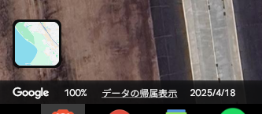
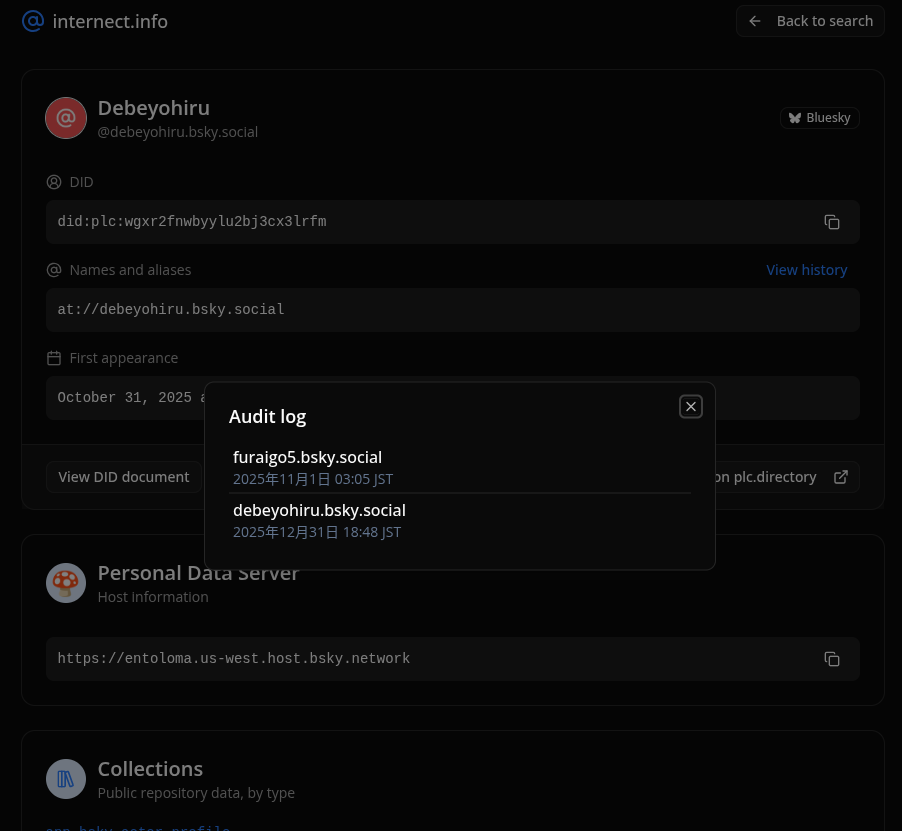
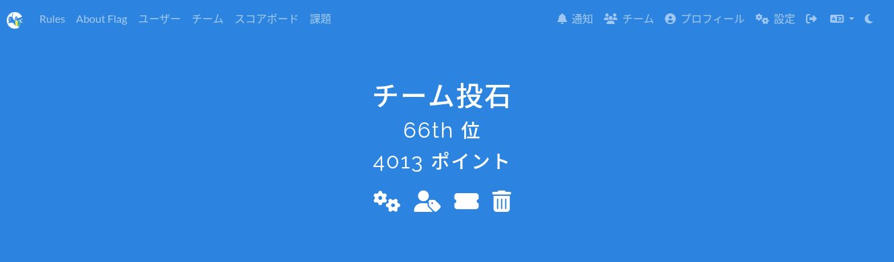

## はじめに

執筆:山田ハヤオ

GITYの裏で活動している秘密結社, 群馬大学投石学部のメンバーで[SWIMMER OSINT CTF 2026](https://swimmer.diverctf.org/)に参加しました。

CTFとはCapture The Flagの略で、何らかに対して調査や攻撃を行うことで目的の情報**Flag**を手に入れるというセキュリティ技術を競う競技です。

CTFには様々な種類がありますが、そのうちの1つがOSINTと呼ばれるものです。Open Source INTelligenceの略で、日本語では公開情報調査などと翻訳されます。インターネット上に公開されている情報(オープンソース)を複数組み合わせて目的の情報を探し出すというもので、主に軍事目的で利用されます。

SWIMMER OSINT CTFは、このOSINTを初心者に学んでもらうためのCTFです。元々はDiver CTFという非常に高度なOSINT技術を要求するCTFを運営していた方たちが、もっと初心者にもOSINTに触れてもらい門戸を広く開きたいということで、このSWIMMER OSINT CTFが開催されたようです。

各メンバーが解いた/挑戦した問題についてwriteupを書きましたので、もしこれを見てOSINTに興味を持った方がいらっしゃいましたら是非ハヤオに声を書けてください。

---

執筆：主宰

このひみつ結社の本格的な活動がDiver CTF参加から始まったことを考えると、初心者向けOSINT CTFの参加が自発的に生えてくるまで成長したのは非常に喜ばしいことです。

私は基本的にバックアップや他チームメンバーを観察してしばらく動かない問題に参加するようにしたため（初回も初回で上の階でカレーを煮ていた気がします）解いた問題は多くありません。

---

### 目次

#### research_2025

1. [CX問題1: フライト便名 (ymdarake)](#cx問題1-フライト便名)
2. [CX問題2: パイロット特定 (ymdarake)](#cx問題2-パイロット特定)
3. [衛星画像の撮影日特定 (山田ハヤオ)](#衛星画像の撮影日特定)
4. [敵国条項死文化決議 - 棄権国調査 (ymdarake)](#敵国条項死文化決議---棄権国調査)
5. [Truck at 11foot8 Bridge (ymdarake)](#truck-at-11foot8-bridge)
6. [トン袋落下地点特定 (ymdarake)](#トン袋落下地点特定)
7. [Rage (ymdarake)](#rage)
8. [鉄塔の正式名称 (torara)](#鉄塔の正式名称)

#### tgt_debeyohiru

1. [debeyohiru_01_social (山田ハヤオ)](#debeyohiru_01_social)
2. [debeyohiru_02_profile (山田ハヤオ)](#debeyohiru_02_profile)
3. [debeyohiru_03_email (山田ハヤオ)](#debeyohiru_03_email)
4. [debeyohiru_04_meal (安部新司)](#debeyohiru_04_meal)
5. [debeyohiru_05_hidden1 (ymdarake)](#debeyohiru_05_hidden1)

#### tgt_rain

1. [rain_01_social (ys)](#rain_01_social)
2. [rain_02_region (torara, 安部新司)](#rain_02_region)
3. [rain_03_source1 (torara)](#rain_03_source1)
4. [rain_04_source2 (torara)](#rain_04_source2)
5. [rain_06_ai (安部新司)](#rain_06_ai)

#### tgt_lilica

1. [lilica_01_social (ys)](#lilica_01_social)
2. [lilica_02_virtual_identity (ys)](#lilica_02_virtual_identity)
3. [lilica_03_virtual_world (ys)](#lilica_03_virtual_world)
4. [lilica_04_domain (ys)](#lilica_04_domain)
5. [lilica_05_hosting (山田ハヤオ)](#lilica_05_hosting)
6. [lilica_06_name (山田ハヤオ)](#lilica_06_name)
7. [lilica_07_work (ymdarake)](#lilica_07_work)

#### その他

1. [flag_on_the_don (ys)](#flag_on_the_don)
2. [ops_swimmer (山田ハヤオ, 安部新司)](#ops_swimmer)

---

## research_2025

### CX問題1: フライト便名

執筆: ymdarake

> 2025年春、かつて香港に存在していた空港の100周年を記念して、特別なフライトが実施されたようです。このフライトの便名を解答してください。

#### 解法

「かつて香港に存在していた空港」というキーワードから **啓徳空港（Kai Tak Airport）** を想起。1925年開港のため、2025年がちょうど100周年にあたる。

Web検索で調べると、2025年3月30日にキャセイパシフィック航空が100周年記念フライト **CX8100** を運航したことが判明。

#### 情報源

- [Geoffrey Lui '95 - CIS Alumni Connect](https://cisalumniconnect.org/geoffrey-lui-95-aviation-cathay-pacific-and-kai-tak-tribute-flight-cx8100/)
- [Cathay Pacific returns to Kai Tak - Checkerboard Hill](https://www.checkerboardhill.com/2025/04/cathay-pacific-flyby-kai-tak-flight-cx8100/)
- [Campaign Brief Asia - CX8100](https://campaignbriefasia.com/2025/04/11/flight-cx8100-takes-off-cathay-soars-once-more-over-kai-tak-in-tribute-to-legendary-flight-path/)
- [CX8100 special flight - FlyerTalk](https://www.flyertalk.com/forum/cathay-pacific-cathay/2190677-cx8100-special-flight-march-30th-4pm-over-kai-tak.html)

---

### CX問題2: パイロット特定

執筆: ymdarake

> CX の問題で示されたフライト中、添付画像の席に座っていた人物の名前を英語で解答してください。（添付画像はコックピット右席を指す矢印）

#### 解法

CX8100便のクルー情報を調査。複数の記事から、このフライトには以下の2名が搭乗していたことが判明。

| パイロット | 役職 | 推定座席 |
| ----------- | ------ | ---------- |
| Geoffrey Lui | Chief Pilot (Airbus) | 左席（Captain/PIC） |
| Adrian Scott | Flying Training Manager | 右席（First Officer） |

**座席配置の根拠:**

- 記事では Chief Pilot が先に言及されている（通常は PIC が先）
- 航空業界の慣例として、最高位のパイロットは左席（Captain席）に座る
- よって右席は **Adrian Scott**

#### 情報源

- [Geoffrey Lui '95 - CIS Alumni Connect](https://cisalumniconnect.org/geoffrey-lui-95-aviation-cathay-pacific-and-kai-tak-tribute-flight-cx8100/)
- [Cathay Pacific returns to Kai Tak - Checkerboard Hill](https://www.checkerboardhill.com/2025/04/cathay-pacific-flyby-kai-tak-flight-cx8100/)
- [Campaign Brief Asia - CX8100](https://campaignbriefasia.com/2025/04/11/flight-cx8100-takes-off-cathay-soars-once-more-over-kai-tak-in-tribute-to-legendary-flight-path/)
- [CX8100 special flight - FlyerTalk](https://www.flyertalk.com/forum/cathay-pacific-cathay/2190677-cx8100-special-flight-march-30th-4pm-over-kai-tak.html)

---

### 衛星画像の撮影日特定

執筆: 山田ハヤオ

> この衛星画像が取得（撮影）された日はいつでしょうか？ YYYY/MM/DD 形式で解答してください。
> 例えば2026年1月17日の場合、Flagは SWIMMER{2026/01/17} となります。

マップの左上に「ケータリングビル」と書かれているのでGoogle Earthで検索してみます。すぐに以下がヒット。

<https://earth.google.com/web/search/%E3%82%B1%E3%83%BC%E3%82%BF%E3%83%AA%E3%83%B3%E3%82%B0%E3%83%93%E3%83%AB/@42.7818063,141.67707077,24.93146269a,600.56938599d,35y,0h,0t,0r/d>

駐車場の車の状況を確認すると、現時点の最新のものと同一であることがわかった。

 

したがって、`SWIMMER{2025/04/18}`

---

### 敵国条項死文化決議 - 棄権国調査

執筆: ymdarake

> 2025年11月の日中関係悪化において、中国大使館が国連憲章の「敵国条項」に言及。日本外務省は「1995年の国連決議によって死文化（obsolete）している」と反論。この決議で棄権した国を特定する。

#### 解法

「敵国条項 死文化 国連決議 1995」などで検索し、該当する決議を特定。

- **該当決議:** 国連総会決議50/52（A/RES/50/52）
- **採択日:** 1995年12月11日

国連デジタルライブラリで投票記録を確認。

##### 投票結果

| 項目 | 数 |
| ------ | ----- |
| 賛成（Yes） | 155 |
| 反対（No） | 0 |
| 棄権（Abstentions） | 3 |

##### 棄権した国（公式記録の表記）

1. **CUBA**
2. **DEMOCRATIC PEOPLE'S REPUBLIC OF KOREA**
3. **LIBYAN ARAB JAMAHIRIYA**

※「LIBYAN ARAB JAMAHIRIYA」は1995年当時のリビアの正式国名

#### 情報源

- [国連デジタルライブラリ 投票記録](https://digitallibrary.un.org/record/284118?ln=en)
- [決議文書 A/RES/50/52](https://documents.un.org/doc/undoc/gen/n95/257/54/pdf/n9525754.pdf)
- [Wikipedia - Enemy state clauses](https://en.wikipedia.org/wiki/Enemy_State_Clauses_in_the_United_Nations_Charter)

---

### Truck at 11foot8 Bridge

執筆: ymdarake

> あるトラックが Plus Code `8773X3XQ+JWQ` を2025年6月21日 13:39:54（現地時間）ごろに通過しました。このトラックの車体に書かれていたFQDNを解答してください。

#### 解法

##### 場所の特定

Plus Code を座標に変換すると、**11foot8 Bridge（通称: Can Opener Bridge）** の場所だと判明。この橋は低い高さ（12'4"）で多くのトラックが衝突することで有名で、定点カメラで撮影・公開されている。

| 項目 | 値 |
| ------ | ----- |
| Plus Code | 8773X3XQ+JWQ |
| 座標 | 35.999063, -78.910188 |
| 場所 | 11foot8 Bridge (Can Opener Bridge) |
| 住所 | 201 South Gregson Street, Durham, NC |

##### 映像の発見

11foot8.com で該当日時の衝突記録（crash #187）を発見。YouTube動画のタイムスタンプ `2025-06-21 13:39:53` が問題の時刻と一致。

動画を確認すると、トラックは引越し業者 **Miracle Movers** の車両で、車体に FQDN **www.MiracleMoversUSA.com** が記載されていた。

#### 情報源

- [11foot8.com](https://11foot8.com/) - The Can Opener Bridge
- [YouTube動画](https://www.youtube.com/watch?v=MJ4tpEhQ86g) - crash #187
- [Miracle Movers USA](https://www.miraclemoversusa.com/) - 会社公式サイト

---

### トン袋落下地点特定

執筆: ymdarake

> 2025年12月8日、日本のあるテレビ番組で、高速道路のパトロール隊への密着取材の様子が放映されました。パトロール隊の108号車は、路上に落下していたトン袋の回収を命じられました。トン袋が最初に落下していた地点はどこでしょうか？

#### 解法

##### 番組特定

「2025年12月8日 高速道路パトロール テレビ」でGoogle検索すると、フジテレビ「サン！シャイン」の密着取材動画がYouTubeでヒット。

- YouTube公開動画: https://www.youtube.com/watch?v=xo_2KZ3n668

##### 字幕からの情報抽出

動画の字幕から以下の情報を抽出:

- 「登りの護国寺合流先、本線センターに大きなトン袋」
- **道路:** 首都高速5号池袋線
- **方向:** 上り（埼玉方面→都心方向）
- **位置:** 護国寺入口（上り）からの合流地点の先

動画に映っている標識などを頼りに、Googleマップで詳細な位置を特定し回答。

---

### Rage

執筆: ymdarake

#### 解法

問題で提示された記事の画像に、店舗のロゴらしき欠片が写っていた。

このロゴの欠片を **Google画像検索** にかけると、**RIPNDIP**（スケートブランド/ショップ）がヒット。記事の対象地域がメキシコシティであることを確認し、メキシコシティのRIPNDIP店舗を調査。

Web検索で店舗の **Instagramアカウント** を発見。投稿を遡り、**オープン記念のポスト**を特定。その投稿日を回答として提出。

---

### 鉄塔の正式名称

執筆: torara

> 2025年12月、日本で地震が発生し、ある通信施設の鉄塔が被害を受けました。主要ニュースで報じられた名称以外に、このビルには通信施設としての別の公式な名前があるようです。その正式名称を日本語で解答してください。

#### AIを活用した調査

問題文をClaude AIに読み込ませ、2025年12月に日本で発生した地震と、それによって被害を受けた通信施設について調査を依頼しました。

Claudeの回答から、当時地震被害が報じられた施設として**「NTT青森八戸ビル」**が候補として挙げられました。

#### 正式名称の特定

このビルについてさらに調査を進めたところ、通信施設としての別の正式名称が存在することが判明。NTTの通信施設には、報道で使われる一般的な名称とは別に、内部的な局名が付けられていることがあります。

NTT青森八戸ビルの通信施設としての正式名称を調査した結果、**八戸NW3棟局**がヒット。他にも何個かの候補が出てきていましたが、「まぁどれかは当たるだろう」の精神で提出したところ、無事Correctでした。

**Flag**: `SWIMMER{八戸NW3棟局}`

---

## tgt_debeyohiru

### debeyohiru_01_social

執筆: 山田ハヤオ

> 調査対象の人物はソフトウェアエンジニアで、2026年以降には debeyohiru というIDでの活動が確認されています。
この人物がこのIDでの活動を開始したのは2026年1月のようです。この人物がこれ以前に使用していたIDを特定できないでしょうか？
2026年1月時点で、noteというサービスに古いIDのアカウントが残存しているようです。
このアカウントのIDを解答してください。
例えば、digital_jpn_gc が対象のアカウントの場合、 Flag は SWIMMER{digital_jpn_gc} となります。

Noteを開き検索窓でdebeyohiruと検索すると [https://note.com/debeyohiru](https://note.com/debeyohiru)が見つかります。

ここから古いIDを探していきます。

他にも、[@debeyohiru@.bsky.social](https://bsky.app/profile/debeyohiru.bsky.social)というBlueskyのアカウントも運用しているようです。

投稿を見ていくと、Blueskyのハンドルネームを変更した[投稿](https://bsky.app/profile/debeyohiru.bsky.social/post/3mbbljxdixs23)が見つかりました。

> あまりいいところのない一年だったから、来年からは心機一転ハンドルを変えてみるというのを思いついた。blueskyだけでも変えてみようか。

かつてのTwitterにはID(@のやつ)の変更を追跡できるサイトがあることを思い出し、似たようなものがBlueskyにもないか探していきます。

Googleで「bluesky 過去のid」のような感じでプロトコルの仕組みやツールを検索していきます。

<https://ruindig.hatenablog.jp/entry/2024/12/13/120000>

BlueskyにはDIDという変更不可能なIDがあるようです。更に検索を続けます。

「bluesky tracking past id」で検索すると以下のサイトがヒットしました。

<https://www.bskyinfo.com/blog/how-to-track-bluesky-handle-history-with-internect-info/>

[https://internect.info/](https://internect.info/)というサイトがBlueskyの内部情報を検索できるようです。

[debeyohiruのIDを入力してあげる](https://internect.info/at/debeyohiru.bsky.social)と過去のIDが見つかりました。



彼は過去に`furaigo5`と名乗っていたようです。これをNoteで検索してあげると

<https://note.com/furaigo5>

が見つかります。

ということでフラグは`SWIMMER{furaigo5}`でした。

---

### debeyohiru_02_profile

執筆: 山田ハヤオ

> debeyohiru は2026年1月時点で求職中で、プロフィールページをウェブ上に公開していたようです。
このページを探り出し、そのURLを解答してください。
例えば、 <https://example.com/foobar> が対象のページの場合、 Flagは SWIMMER{<https://example.com/foobar}> となります。

Debeyohiruやfuraigo5をGoogleで検索してみても特に何も見つからず。BingやYandex、DuckDuckGo等で検索を行うも特にありませんでした。
何故かYandexで法律的にアウトスレスレなえっちなものが出てきて普通に困惑していました。

`furaigo5`を横断検索ツールで検索すると、GitHubにヒットし <https://github.com/furaigo5> を発見しました。

プロフィールのURLにアクセスすると、就職用のプロフィールページでした。

ということでフラグは`SWIMMER{https://furaigo5.github.io/profile/}`になります。

---

### debeyohiru_03_email

執筆: 山田ハヤオ

> debeyohiru が2026年現在、普段使っているメールアドレスが知りたいです。
この人物が現在使用中とおぼしきメールアドレスを探り出し、解答してください。
例えば、メールアドレスが<foobar@example.com>の場合、Flagは SWIMMER{<foobar@example.com>} となります。

GitHubのAPIを叩いてメールアドレスが手に入らないか試みましたが見つからず。

```bash
gh api users/furaigo5
```

改めて前のホームページを見ると、そのまま記載されていました。なんてこった。

`SWIMMER{furaigo5.onionsoup@gmail.com}`

---

### debeyohiru_04_meal

執筆: 安部新司

チームメンバーが場所を「渋谷スペイン坂店」であると特定してくれていました。

参考：[Bluesky投稿](https://bsky.app/profile/debeyohiru.bsky.social/post/3mbqqz6vd5225)

この情報を元に手動でGoogleマップのレビュー（口コミ）を見に行くと、該当する記録が残っていました。
この手の問題は大会後半になると正解となる投稿に参加者が多くアクセスするため見つけやすくなる傾向にあります。最後まで諦めずに挑戦しましょう。（もちろん現実でのOSINTでは関係ありません。）

---

### debeyohiru_05_hidden1

執筆: ymdarake

#### 本名特定

これまでの問題で明らかになっていたプロフィールページを開き、**Chrome DevTools** で調査。

Networkタブでリクエスト/レスポンスを確認し、読み込まれているリソースをざっと眺めていたところ、JavaScriptファイルが目に入った。

`https://furaigo5.github.io/profile/js/script.js` を確認すると、ファイル冒頭の **`@author` タグ**に本名が記載されていた。その名前を回答として提出。

---

## tgt_rain

### rain_01_social

執筆: ys

> rain は2026年時点でXのアカウントを所持していたようです。我々は、この人物の投稿のスクリーンショットを入手しました。スクリーンショットからアカウントを特定し、このアカウントのID（スクリーンネーム）を解答してください。例えば、@gov_online が対象のアカウントの場合、Flag は SWIMMER{@gov_online} となります。

#### 解法

- スクリーンショットに写っている本文（特徴的な文言）から、固有フレーズ **「近所だったから見に行った」** を抽出。
- X上で当該フレーズ検索を実施。
  - 普段使用しているアカウントでは検索にヒットしなかった。
  - 別アカウントで同様に検索したところヒットし、該当投稿を特定。
- 該当投稿の投稿者プロフィールからスクリーンネーム **@bruto_rain** を特定。
- Flag: `SWIMMER{@bruto_rain}`

#### 情報源

- [X](https://x.com/home)

---

### rain_02_region

執筆: torara

> `rain` は自身のブログに趣味の投稿を行っていたようです。投稿に用いられている写真のほとんどがこの人物の撮影したものではないフェイクのようですが、1枚だけ、実際にこの人物が撮影したと考えられる写真が存在します。その写真を特定し、撮影地を地図上で解答してください。

#### 初期アプローチ（失敗）

最初は「10回回答できるんだから、どこか書けば当たるだろう」という甘い認識でした。小牛田駅、自由が丘、阪急梅田（存在しないのに）、東京駅などを適当に提出して全滅。AIの画像という発想が全くありませんでした。

次にヒントから「関東周辺に住んでいない」という情報が出てきましたが、これも活かしきれず。

#### 方針転換

`rain`のWordPressブログ（https://brutorain.wordpress.com/）を確認し、各投稿の写真を調査しました。

ヒントの情報を整理すると：

- 「遠征」というキーワードを含む記事を見る
- AIで生成したものが含まれている
- 写真の大半はインターネット上から拾ってきたもの

これらから、1枚1枚地道に判断していく方針に切り替えました。

#### 画像検索の試行

初出の画像を見つけるために[Yandex画像検索](https://yandex.com/)を使用しました。初めて使用しましたが、個人的にかなり使用感が良かった印象です。ただ、「インターネット上から拾ってきた」というのが具体的にどれを指していたのかは最後までよくわかりませんでした。

#### AI画像の判定（突破口）

明らかにAIだとわかるものから、本物にしか見えないものまで様々でしたが、この判定作業が前進できた最大の要因でした。

**AI生成と判断した根拠：**

- 駅名表示が実在しない架空の駅名
- 電車の形状が実在する車両と微妙に異なる
- 車内広告のデザインや文字列が不自然
- Google画像検索で元画像が見つからない、または明らかにAI生成の特徴がある

**本物と判断した根拠：**

- 電車の型番が実在する「阪京10053」系と一致
- 駅の構造や周辺環境が自然
- AI生成特有の不自然さが見られない

#### 駅の特定

チームメイトから「牧野駅ではないか」という進言があり提出しましたが、incorrect。座標ズレかと思って再提出する羽目にもなりました（一瞬「この画像じゃないのでは」と疑ってしまい危なかった）。

結局この問題が最後まで残り、写真に写っている特徴的な構造物や周辺環境を手がかりに再調査した結果、**星が丘駅**であることが判明しました。

Google Mapsで星が丘駅周辺を確認し、撮影位置を特定：

**緯度経度**: `34.80759293430834, 135.65967419740656`

**Flag**: `34.80759293430834, 135.65967419740656`

最後の最後でCorrectできて本当に安心しました。

#### 安部新司による補足

各画像をダウンロードして画像のメタデータを確認します……が、何もありません。必須チャンクのみが残されており、意図的にメタデータを削除する処理がなされているようです。

そこでデータ形式を確認すると、ほとんどの画像がRGBカラー形式であるにも関わらず、2つの画像のみRGBAカラー形式となっていました。

この2枚のうち、AI特有の崩れが無い側の文字情報を追っていきます。

画像内に病院の広告が2つ確認できたため、これらを検索すると実在する病院らしいです。    病院に近い駅のうち、奥に写っている高い建物との位置関係が良さそうなものを選定し、駅内の撮影場所を大まかに絞って提出。

---

### rain_03_source1

執筆: torara

> `rain` は、目を引くタイトルの記事を書くことで閲覧数が多くなると考えたようです。この人物はこれをきっかけとして偽情報の作成・流布にのめり込んでしまったと考えられます。この人物が一番最初に投稿した偽記事では、ある画像に全く関係ないキャプションが付けられています。本来の出典を探し、この画像がどこの市区町村にまつわる資料に掲載されたものか解答してください。都道府県名を含む必要はありません。

#### 偽記事の特定

まず「偽記事はどれか」という点について、rainのX（https://x.com/bruto_rain）から意外とすぐに特定できました。

- 12/18：何かしらの力に目覚める
- 12/20：「タイトル変えるだけで閲覧数って増えるんだな」という投稿

この流れを見ると、12/19の記事「気付いてしまった！！」が最初の偽記事である可能性が高いと判断しました。

#### 画像検索の壁

しかし難しいのはここから。記事に掲載されている「工事中の濾過地(其一)」を画像検索しても、金町浄水場しかヒットしません。

最初は東京都水道歴史館（https://www.ro-da.jp/suidorekishida）にあると思い探しましたが、同じと思われる画像は見つかりませんでした。

#### LLMによる調査（不発）

LLMに画像と一致するものの捜索を依頼したところ、以下の候補が挙がりました：

- 土木学会附属土木図書館 デジタルアーカイブス「土木工事写真集」
- 境浄水場（武蔵野市）
- 和田堀給水所（世田谷区）

しかし、いずれも核心には至らず。

#### Geminiによる突破口

決め手となったのはGeminiでした。[国立国会図書館デジタルコレクション](https://dl.ndl.go.jp/)内にある『名古屋市水道拡張工事記念写真帖』という資料を見つけてきました。

この前にrain_04_source2を解いており、「国立国会図書館デジタルコレクション内にあるのでは」という仮説が立っていました。

**検索クエリ**: `濾過地 工事`

試しに「高知市水道誌」を見てみたところ、問題で与えられている画像と資料内の画像の形状や年代がかなり近いことがわかりました。他にも長岡市、豊橋市、広島市、甲府市等の候補があったため、2人で手分けして調査。

チームメイトが豊橋市の資料に同じ画像があることを発見し、正解に辿り着きました。

**Flag**: `SWIMMER{豊橋市}`

---

### rain_04_source2

執筆: torara

> `rain` が2番目に作成した偽記事には、「rainが未公開の情報を見つけた」ということが書かれているようです。しかし、これは虚偽だと思われます。この人物の嘘を暴くには、正確な出典を探す必要があります。この画像の出典となる古い書籍は電子化されており、詳細が参照できるはずです。その資料のデジタルオブジェクト識別子(DOI)を解答してください。

rain_02に行き詰まりすぎたため、こちらに挑戦。

#### 画像検索

`rain`のWordPressブログ（https://brutorain.wordpress.com/）内の2番目の記事「誰も知らない真実を発見」を確認しました。

記事内に掲載されている画像をGoogle画像検索にかけたところ、一発で以下のWikipediaページがヒット：

https://zh.wikipedia.org/wiki/File:National_Diet_Building_Competition_Submission_Watanabe_Fukuzo.jpg

このページから、画像は国立国会デジタルコレクション内にある**国会議事堂の建築設計競技**に関連するものであることが判明しました。

#### DOIの特定

画像の出典を特定するため、国立国会図書館デジタルコレクションを調査しました。

**検索クエリ**: `議院建築`、`設計競技`

以下の資料を発見：『議院建築意匠設計競技図集』

国立国会図書館デジタルコレクションで該当資料のDOIを確認：

**Flag**: `SWIMMER{10.11501/967480}`

これが初のCorrect。チームに貢献できないのではとひやひやしていたので、本当に一安心でした。

---

### rain_06_ai

執筆: 安部新司

各画像をダウンロードしてメタデータを確認すると、以下の情報が残っていました。

JSON

```json
{
  "aigc_info": {
    "aigc_label_type": 0,
    "source_info": "dreamina"
  },
  "data": {
    "os": "web",
    "product": "dreamina",
    "exportType": "generation",
    "pictureId": "0"
  },
  "trace_info": {
    "originItemId": "7590949739743448328"
  }
}
```

`product` フィールドに `dreamina` と記載されています。

---

## tgt_lilica

### lilica_01_social

執筆: ys

> lilica は2026年時点でクリエイターとして活動しており、「黄昏ブロッサムリリカ」と名乗っていたことが分かっています。 また、Xのアカウントを持っていたことが確認されています。そのXアカウントのID（スクリーンネーム）を解答してください。例えば、@gov_online が対象のアカウントの場合、Flag は SWIMMER{@gov_online} となります。

#### 解法

- 既知の名義 **「黄昏ブロッサムリリカ」** を検索クエリとしてXで検索。
- ヒットしたアカウントのプロフィール・投稿内容から本人性を確認。
- スクリーンネーム **@twilight_lilica** を特定。
- Flag: `SWIMMER{@twilight_lilica}`

#### 情報源

- [X](https://x.com/home)

---

### lilica_02_virtual_identity

執筆: ys

> lilica はVRにも関心があるようで、未来でもVR関連の活動がわずかながら確認されています。lilica が2026年時点で使っていたVRChatのユーザーIDを特定し、解答してください。VRChatのユーザー情報はブラウザからも確認できます。例えば、対象アカウントのURLが https://vrchat.com/home/user/usr_xxxxxxxx-xxxx-xxxx-xxxx-xxxxxxxxxxxx の場合、 Flagは SWIMMER{usr_xxxxxxxx-xxxx-xxxx-xxxx-xxxxxxxxxxxx} となります。

#### 解法

- VRChat内で **「黄昏ブロッサムリリカ」** を検索。
- ヒットしたユーザー情報から対象ユーザーを特定。
- ブラウザで当該ユーザーのページ（ https://vrchat.com/home/user/usr_b103fac6-8341-4b89-a606-920092e75e43 ）を確認。
- URLに含まれるユーザーID **usr_b103fac6-8341-4b89-a606-920092e75e43** を抽出。
- Flag: `SWIMMER{usr_b103fac6-8341-4b89-a606-920092e75e43}`

#### 情報源

- [VRChat Home](https://vrchat.com/home)

---

### lilica_03_virtual_world

執筆: ys

> lilica はVRChatでの活動をSNSに投稿していたようです。2025年11月9日（日本時間）に投稿された画像にはある「ワールド」が写っているようです。このワールドのIDを解答してください。VRChatのワールド情報はブラウザからも確認できます。例えば、対象のワールドのURLが https://vrchat.com/home/world/wrld_xxxxxxxx-xxxx-xxxx-xxxx-xxxxxxxxxxxx/info だった場合、Flagは SWIMMER{wrld_xxxxxxxx-xxxx-xxxx-xxxx-xxxxxxxxxxxx} となります。

#### 解法

- 該当ツイートの添付画像を入手し、Google画像検索で類似画像／掲載ページを探索。
- VRChatワールド紹介ブログ記事がヒットし、画像のワールド名に関する手掛かりを取得。
- ブログ記事等で得たキーワード **「NAGISA」** をもとに、VRChat内のWorld検索で候補を絞り込み。
- 該当ワールドを特定後、ブラウザでワールドページ（ https://vrchat.com/home/world/wrld_1b94e327-036b-4d09-81be-e898d71f02cb/info ）を確認。
- URLからワールドID **wrld_1b94e327-036b-4d09-81be-e898d71f02cb** を抽出。
- Flag: `SWIMMER{wrld_1b94e327-036b-4d09-81be-e898d71f02cb}`

#### 情報源

- [VRChat Home](https://vrchat.com/home)
- [VRC World Guide 該当記事](https://vrc-world-guide.hatenablog.com/entry/2025/01/27/213500)

---

### lilica_04_domain

執筆: ys

> lilica は個人のWebサイトを運営していたようです。このWebサイトのドメイン名が取得された日付が知りたいです。YYYY/MM/DD の形式で解答してください。例えば、2026年1月2日 がドメイン取得日の場合、Flagは SWIMMER{2026/01/02} となります。

#### 解法

- 12/13 のX投稿から lilica の個人サイトへ遷移し、対象ドメインを取得。
- 対象ドメインをドメイン情報検索（WHOIS等）で照会。
- 結果に含まれる **登録日（Creation Date / Registered On 等）** を取得日として採用。
- 指定フォーマット（YYYY/MM/DD）に変換し、Flag形式に整形して回答。

#### 情報源

- （未記入：実際に使用したWHOIS/ドメイン検索サービスのURL）

---

### lilica_05_hosting

執筆: 山田ハヤオ

チームメイトから`twilight-lilica.com`のホスティングサービスを特定してほしいとのことだったので、`traceroute`コマンドで経路を特定しました。

```txt
hayao@Hayao-XPS9350 ~> traceroute twilight-lilica.com
traceroute to twilight-lilica.com (45.77.129.141), 30 hops max, 60 byte packets
 1  _gateway (192.168.128.1)  8.374 ms  8.292 ms  8.281 ms
 2  ntt.setup (192.168.1.1)  8.257 ms  8.248 ms  8.238 ms
 3  * * *
 4  * * *
 5  * * *
 6  * * *
 7  * * *
 8  * * *
 9  * * *
10  * * *
11  xxxxxxxxxxxx.jp.ce.gin.ntt.net (xx.xx.xx.xx)  24.853 ms * *
12  * * *
13  * * *
14  209.222.31.250.vultrusercontent.com (209.222.31.250)  22.751 ms  22.697 ms  22.683 ms
15  * * *
16  * * *
17  * * *
18  * * *
19  * * *
20  * * *
21  * * *
22  * * *
23  * * *
24  * * *
25  * * *
26  * * *
27  * * *
28  * * *
29  * * *
30  * * *
```

`vultrusercontent.com`を調べると、[Vultr](https://www.vultr.com/)を発見。

通報のためのメールアドレスとのことなので以下のサイトより、フラグは`SWIMMER{abuse@vultr.com}`

<https://www.vultr.com/legal/use-policy/>

---

### lilica_06_name

執筆: 山田ハヤオ

既に他のチームメイトによってTwitterが特定されていたので、投稿を確認します。

> 面白くなっちゃって
> とりあえず髪留めこねてみたんだけど
>
> これどうやったらVRCのアクセサリにできるんだろう？

<https://x.com/twilight_lilica/status/2000551415039791278>

Gigafile便で何やらモデルデータを配布しているようです。ダウンロードするとfbxという拡張子のバイナリデータでした。

```txt
hayao@Hayao-XPS9350 ~/Desktop> file simple_hair_pin.fbx
simple_hair_pin.fbx: Kaydara FBX model, version 7700
```

`file`コマンドで確認してあげるとこんな出力が。よくわからないので`strings`コマンドでテキストを探してみる。

```bash

hayao@Hayao-XPS9350 ~/Desktop> strings simple_hair_pin.fbx | sort | uniq
(省略)
.]P~_2zA
0<=7
0|`+
1/#5
15/11/2025 00:00:00.000
15/11/2025 00:00:00.000
2025-11-16 04:30:11:874
2025.3.2
4@'6
70000$F
:|`+
(省略)
?D8,
@c|
@u\;]
AD8,
ADgfffff
ActiveAnimStackNameS
AmbientColorS
(省略)
C:\Users\shiharu_nanaogi\Documents\modeling\vrc_test\hair_pin\simple_hair_pin.fbx
C:\Users\shiharu_nanaogi\Documents\modeling\vrc_test\hair_pin\simple_hair_pin.fbxD
CILP
Casts ShadowsS
Cinema 4D2025.3.2d
Collection
DisplacementFactorS
DocumentLPG
DocumentUrlS
E-QV
EmissiveColorS
EmissiveFactorS
EmissiveS
EncryptionTypeI
FBX SDK/FBX Plugins version 2020.3.4
FBX SDK/FBX Plugins version 2020.3.4 build=9634e3495v
FBXHeaderExtensiont
FBXHeaderVersionI
FBXVersionI
FbxMesh0.
FbxNodeN+
(省略)
MaxDampStrengthYS
MaxDampStrengthZS
Maxon
Maxon Cinema 4D 2025.3.2W
MemberS%
(省略)
VersionIe
VersionIf
Verticesd
Visibility InheritanceS
VisibilityS
Vs S
Y?7>
YearI
[J]>
]8Z=
^ g\
_'^`W
_____C1_1_SelectionNode
_____C1_1_SelectionSet
_____C2_2_SelectionNode
_____C2_2_SelectionSet
_____R1_3_SelectionNode
_____R1_3_SelectionSet
_____R2_4_SelectionNode
_____R2_4_SelectionSet
_____S_0_SelectionNode
_____S_0_SelectionSet
_____selectionComplement_SelectionNode
_____selectionComplement_SelectionSet
b\TB
boolS
cX{T
doubleS
enumS
g$$^g
g9wJ
(省略)
~2_{
~BG^(
```

ファイルのフルパスや使用されているソフトウェア、作成日時といったそれらしいデータを取得できました。

ということで、パスのユーザー名より`SWIMMER{Shiharu Nanaogi}`

---

### lilica_07_work

執筆: ymdarake

それまでに明らかになっていた本名を、ヒントをもとに **Facebook → Instagram** の順で検索。

Instagramに本名のローマ字そのままのアカウントを発見。投稿によく出てきていた場所にメトロの駅があることを確認し、その駅名を回答。

---

## その他

### flag_on_the_don

執筆: ys

> 2025年8月28日、群馬県で「太鼓の達人」を利用したイベントが開催されました。その会場となった建物はどこでしょうか。OpenStreetMapのウェイ（way）番号で解答してください。例えば、建物が 123456789 というway番号であれば、Flagは SWIMMER{123456789} となります。

#### 解法

- 問題文をChatGPTエージェントに渡して解法を探索。
  - 2025年8月28日に渋川市で「シニアeスポーツイベント」が開催されたことを特定。使用タイトルは「太鼓の達人ドンダフルフェスティバル」等。
  - 会場は **「渋川市民会館」**。
- OpenStreetMapで「渋川市民会館」を検索し、該当する建物（way）を特定。
- way番号 **628293186** を取得。
- Flag: `SWIMMER{628293186}`

#### 情報源

- [渋川市PDF（参照資料）](https://www.city.shibukawa.lg.jp/manage/contents/upload/68870b94eeb0d.pdf)

---

### ops_swimmer

#### 山田ハヤオによる調査

最終問題です。この問題は全てを解き終わると出現するようになっていたのですが、それに気づかず完答したと思い込んでいました。

writeupを書くために再びアクセスしたところ、この問題を発見。この時点で23:45分で大焦り。チーム全員で一斉に取り掛かりました。

私が解けなかった debeyohiru_05_hidden1やdebeyohiru_06_hidden2の調査でdebeyohiru氏の調査をしていたなかで、こんなものを見つけていました。

```txt
🗓️ Calendar data

[+] Public Google Calendar found !

Calendar ID : furaigo5.onionsoup@gmail.com
[+] Calendar Summary : ふらいご
Calendar Timezone : Asia/Tokyo

[+] 1 event dumped ! Showing the last 1 one...

╔══════╤═════════════════════╤══════════╗
║ Name │   Datetime (UTC)    │ Duration ║
╟──────┼─────────────────────┼──────────╢
║ 集会 │ 2025/12/30 09:30:00 │ 2 hours  ║
╚══════╧═════════════════════╧══════════╝

🗃️ Download link :
=> https://calendar.google.com/calendar/ical/furaigo5.onionsoup@gmail.com/public/basic.ics
```

これはfuraigo5名義のホームページに書かれているメールアドレスをGHuntに投げた結果です。

この`basic.ics`を覗いてみると、こんな感じになっていました。

```txt
BEGIN:VCALENDAR
PRODID:-//Google Inc//Google Calendar 70.9054//EN
VERSION:2.0
CALSCALE:GREGORIAN
METHOD:PUBLISH
X-WR-CALNAME:ふらいご
X-WR-TIMEZONE:Asia/Tokyo
BEGIN:VEVENT
DTSTART:20251230T093000Z
DTEND:20251230T113000Z
DTSTAMP:20260117T093404Z
UID:57ol3cl8unee2aa4291ofbqcvp@google.com
CREATED:20251228T070800Z
DESCRIPTION:18:30集合\n店の前
LAST-MODIFIED:20260102T164452Z
SEQUENCE:1
STATUS:CONFIRMED
SUMMARY:集会
TRANSP:OPAQUE
END:VEVENT
END:VCALENDAR
```

ということで、2025年12月30日 18時30分にどこかの店の前に集合になっていることがわかりました。

更に調査を続けていきます。

<https://x.com/twilight_lilica/status/2007451888996724926>

<https://x.com/twilight_lilica/status/2007449492468211719>

ブロッサムリリカがその時の食事の画像を投稿しています。この写真より、デニーズであることがわかりました。

更にコミケのあとであるという情報から、東京(いくら無理に考慮しても関東圏内)であることがわかります。

<https://x.com/bruto_rain/status/2007384438939021503>

rain氏も似たような画像を投稿しています。映り込んでいる料理が同じであることから、これらの写真は同じ場所で撮影されたものであると推測されます。

ここまでの情報で、以下のことがわかりました。

- 集合時刻: 2025年12月30日 18時30分
- 解散予定: 2025年12月30日 20時30分
- コミケのあとに行ける→東京? (最悪でも関東?)

これらの情報から有明に近い以下の店舗の内装をGoogle Mapで調べて回答してみるも正解にならず……。正直残り数分だったのでかなり焦っていました。入れてみてだめだったフラグは以下。

- `SWIMMER{2025/12/30_1830_デニーズ江東枝川店}`
- `SWIMMER{2025/12/30_1830_デニーズ渋谷公園通り店}`

流石に大雑把すぎるということで方針を変えようとしてた瞬間、一足先に帰宅したはずのチームメンバーがチャットに以下のURLを投稿。

<https://x.com/bruto_rain/status/2006604801514057878>

<https://x.com/bruto_rain/status/2005982246499742052>

同時刻に、rain氏(我々は彼のことを鉄オタ君と読んでいました)が大手町での写真を掲載してたのを見つけてくれました。

ということでフラグは`SWIMMER{2025/12/30_1830_デニーズ大井町駅前店}`でした。

#### 安部新司による補足

日時についてはチームメンバーが特定してくれていたため、周辺の投稿でそれらしいものを探します。

[https://x.com/bruto_rain/status/2006604801514057878](https://x.com/bruto_rain/status/2006604801514057878)

これだけから「デニーズ大井町駅前店」で一回の提出権を使うのは面白くありません。 [https://x.com/bruto_rain/status/2005982246499742052?s=20](https://x.com/bruto_rain/status/2005982246499742052?s=20)

この投稿画像の文字情報から、品川区の「地域美化推進地区」について調べると以下の資料がヒットします。
 [路上喫煙禁止地区・地域美化推進地区（PDF）](https://www.city.shinagawa.tokyo.jp/PC/kankyo/kankyo-kankyo/rojoukituennkinsitiku.pdf)
この資料を確認すると、場所が大井町駅前店であることに矛盾せず、満足したので提出。

## おわりに

執筆: 山田ハヤオ

無事に時間内に全てを解ききることができました。上位勢は半分以下の時間で全てを解き切っているので、これからの精進してOSINT力を上げていければと思います。

結果は66位でした。


